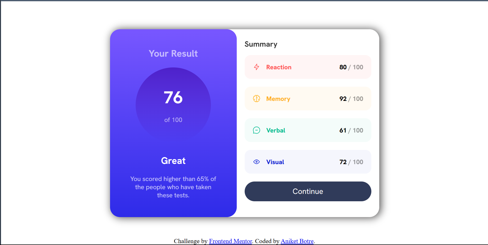
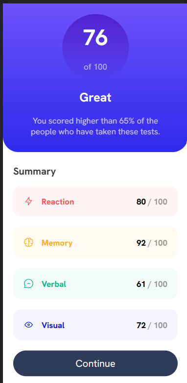

# Frontend Mentor - Results summary component solution

This is a solution to the [Results summary component challenge on Frontend Mentor](https://www.frontendmentor.io/challenges/results-summary-component-CE_K6s0maV). Frontend Mentor challenges help you improve your coding skills by building realistic projects. 

## Table of contents

- [Overview](#overview)
  - [The challenge](#the-challenge)
  - [Screenshot](#screenshot)
  - [Links](#links)
- [My process](#my-process)
  - [Built with](#built-with)
  - [What I learned](#what-i-learned)
  - [Continued development](#continued-development)
- [Author](#author)

## Overview

### The challenge

Users should be able to:

- View the optimal layout for the interface depending on their device's screen size
- See hover and focus states for all interactive elements on the page

### Screenshot

### Links

- Solution URL: [Add solution URL here](https://github.com/Aniket200-ind/result-summary)
- Live Site URL: [Add live site URL here](https://aniket200-ind.github.io/result-summary/)

## My process

### Built with

- Semantic HTML5 markup
- CSS custom properties
- Flexbox
- CSS Grid
- Mobile-first workflow

### What I learned

I learned how to use grid to make the layout of the page. I also learned how to use flexbox to center the elements. I also learned how to use the CSS variables to make the code clean and easy to read. I also learned how to use the media query to make the page responsive. Most importantly, I followed mobile-first approach for this project!!

### Continued development

I would like to lessen the time on designing and css stuff. I would also like to focus more on using proper semantics where needed. I would also like to focus more on the mobile-first approach.

## Author

- Frontend Mentor - [@Aniket Botre](https://www.frontendmentor.io/profile/Aniket200-ind)
- LinkedIn - (https://www.linkedin.com/in/aniket-botre-9608901b8/)
